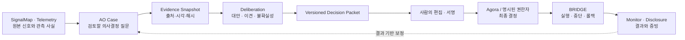

# MOSS.AO 장기 방향 — Decision Intelligence

> 상태: 제안. 코드 변경 없음. 이 문서는 **무엇을 만들 것인가**보다 **무엇을 만들지
> 않을 것인가**를 고정하기 위한 것이다.
> 기준 커밋: `8a677be` (2026-08-06, CI 4/4 통과). 아래 인용된 파일·라인은 모두 그
> 시점의 소스에서 직접 확인했다.

---

## 1. 한 문장

> **AO는 하나의 Case를 정확한 근거, 대안, 반대 의견, 실행·측정 조건이 포함된 검증
> 가능한 Decision Packet으로 만들고, 공식 결정 직전에서 멈추는 의사결정 준비
> 워크벤치다.**

"분석·숙의·계획"이라고 정의하면 지금과 같은 범위가 된다. 위 문장에서 실제로
경계를 긋는 것은 마지막 절이다 — **AO는 결정하지 않는다.** 모델은 추천하고,
사람은 패킷을 검토하며, Agora나 명시된 권한자가 결정한다.

제품명은 그대로 두되 외부 설명은 `MOSS.AO — Decision Intelligence`가 적합하다.

---

## 2. 살릴 기반

방향을 바꾼다고 해서 지금 있는 것 대부분을 버린다는 뜻은 아니다. 다음은 그대로
자산이다.

- 12개 신호 어댑터와 DB 중심 저장 구조 (2026-08 SignalMap 추가,
  [`docs/signalmap.md`](signalmap.md))
- 다단계 토론 인프라, 모델·토큰·비용 기록
- 로컬 모델 우선 처리와 유료 모델 2차 심사 (`scoring/second_pass.py`) —
  **이것은 이 저장소의 유일한 실제 불확실성 장치다.** 비교적(형제 아이디어를 나란히
  보여줌), 비대칭적("잘못된 confirm이 잘못된 demote보다 훨씬 비싸다"), 그리고
  **fail-closed**(리뷰 불가 시 승격하지 않고 보류). 재구축 대상이 아니라 확장 대상
- 아이디어 클러스터링과 중복 억제 (`backlog.clustering`, 정밀도 기준으로 튜닝됨)
- FastAPI / Next.js / PM2 / readiness / 배포 가드 / 롤링 백업

문제는 이 부품들이 아니라, 그것들이 **무엇을 향해 조립돼 있는가**다.

---

## 3. 진단 — 검증된 것만

아래 여섯 항목은 각각 독립적으로 코드를 열어 확인하고, 다시 반증을 시도해 살아남은
것이다. **판정을 그대로 옮기고, 과장된 서술은 깎았다.**

### 3.1 토론 진입에 "이것이 결정할 수 있는 질문인가"를 묻는 곳이 없다 — 확인됨

`scheduler/tasks.py:1517 _run_debate_async()`는 최신 트렌드에서 토픽 문자열을 만들어
바로 `run_multi_stage_debate()`로 넘긴다. 하류에도 검사는 없다:
`debate/protocol.py:324-338 validate_message()`는 메시지 타입과 길이 10자만 본다.
`DebateRepository`의 17개 메서드에 `topic`이라는 문자열은 **한 번도 등장하지 않는다**
(중복 토픽 방지 없음).

여기에 더해, 토픽 선택 자체가 뒤집혀 있을 가능성이 크다.

- `trends/analyzer.py:361, 387`은 트렌드를 **점수 내림차순으로 정렬해** 반환한다.
- `tasks.py:276`은 그 순서대로 저장하며 `tasks.py:300`에서 행마다 `analyzed_at = utcnow()`를 찍는다.
- 그 사이에 행마다 Ollama 번역 호출이 **두 번** 있다 (`tasks.py:279-280`) — 행 간격이 초 단위다.
- 조회는 `analyzed_at` 내림차순, 동률 시 `score` 내림차순이다 (`repositories.py:186`).

즉 한 배치 안에서 **점수가 낮을수록 `analyzed_at`이 늦고**, 동률 타이브레이커는
발동할 수 없다. `recent_trends[0]` — 토론 토픽 — 는 사실상 최신 배치에서 **가장
점수가 낮은** 트렌드가 된다. 게다가 `analyzer.py:519-536 _parse_trends_fallback()`은
정규식 매치 순서로 `score = 10.0 - i`를 부여하므로, 그 점수 자체가 순서 인공물일 수
있다.

> **단서:** 이 마지막 단락은 **코드 판독**이며 운영 DB의 실제 행으로 확인하지
> 않았다(작업 트리에 `data/orchestrator.db`가 없다). 공표 전에 프로덕션에서
> `SELECT name, score, analyzed_at FROM trends ORDER BY analyzed_at DESC LIMIT 10`을
> 한 번 돌려 확인할 것.

**대가:** 토픽이 결정 가능한 질문인지 아무도 묻기 전에, 유료 티어 토론 1회
(**38 콜, 273k in / 54k out, $0.446**, config.yaml `budget` 주석의 실측값)와 약
30분이 이미 커밋된다. 다만 **오늘 그것이 프로젝트를 스캐폴드하지는 않는다** —
`project.auto_generate.enabled: false` (2026-08-06 일시정지).

### 3.2 프롬프트는 신제품 기획을 요구하고, 코드는 아무것도 강제하지 않는다 — 부분적으로 사실

프롬프트 층은 초안 주장 그대로다. `debate/protocol.py:515-524`는 기술 스택, MVP
범위, 로드맵, "측정 가능한 KPI 2-3개"를 요구하고 `:545-556`은 그 JSON 키를 못박는다.
실현가능성 기준은 `:602` **"1-2주 내 MVP 구현 가능성"** — 결정 루브릭이 아니라
제품 출시 루브릭이다.

**그러나 코드는 그 계약을 지키지 않는다.**

- `multi_stage.py:1069 _validate_idea_content()`는 `idea_title` / `core_analysis` /
  `proposal`만 본다. `tech_stack`·`mvp_scope`·`roadmap`·`kpis`는 **검증되지 않는다.**
- 검증 실패는 로그만 남기고 통과시킨다 — `multi_stage.py:1345-1347` `# Continue anyway`.
- 토론 경로의 어떤 `route()` 호출도 `response_schema`를 넘기지 않는다 (대조:
  `scoring/__init__.py:222`는 문법 제약을 건다).
- `_extract_idea_from_response()`에는 `return None` 경로가 없다. 섹션이 하나도 없는
  응답도 `multi_stage.py:1557`의 합성 제목으로 Idea가 된다.
- `protocol.py:560` *"Ideas will not be saved if the format is incorrect"*는 코드가
  지키지 않는 **허풍**이다.

수렴 단계도 마찬가지다. 프롬프트는 5기준 가중 비교지만
(`protocol.py:594-651`), `multi_stage.py:1584-1621 _extract_scores_from_response()`는
루브릭을 버리고 정규식으로 1-10 정수 하나를 긁는다. 패턴 2-3은 아이디어와 무관하게
매치되므로 제목이 그대로 되풀이되지 않는 아이디어는 **전부 같은 숫자**를 받는다
(모듈 자체 코드로 재현: 서로 다른 세 아이디어 → `{a: 8.0, b: 8.0, c: 8.0}`).
동점 + 안정 정렬 ⇒ 상위 5개 = **생성 순서**.

정확한 표현은 이렇다: 시스템은 출시 산출물을 요구하고 **돌아온 것을 그대로 받는다.**
그래서 코퍼스는 내용 보증 없는 MVP/KPI 형식으로 가득하다.

### 3.3 계획 단계는 개정이 아니라 선택이다 — 확인됨

```python
# multi_stage.py:498-500
# Merge drafts (simple: use first comprehensive one)   ← 주석은 낡았다
if drafts:
    draft_plan = max(drafts, key=len)
```

선택자는 **글자 수**다. `draft_plan`은 여기서 한 번 대입되고 **다시는 대입되지
않는다.** 2라운드(프로덕션 `planning_rounds: 2`)는 리뷰를 돌리고 그 결과에서
`feedback`을 언패킹하지만(`:521`) 그 변수는 어디에도 쓰이지 않는다. 저장되는 것은
`"final_plan": draft_plan`(`:542`)이며 Plan 행에 바이트 그대로 들어간다.

리뷰 프롬프트(`protocol.py:686-693`)는 강점/약점/리스크/제안과
**Approved / Needs Revision / Rejected** 판정을 요구한다. 그 판정을 담을 필드가
결과 객체에 없다. 집계된 `approval_rate`는 `multi_stage.py:545`에서 **쓰이기만 하고
읽는 코드가 저장소 전체에 없다** (`grep`가 그 한 줄만 반환한다).

> **자연스럽지만 틀린 처방을 미리 막아둔다.** "이미 있는 합의 판정을 연결하기만
> 하면 된다"는 **무효(no-op)**다. `_check_consensus`는
> `MessageType.VOTE`만 세는데(`protocol.py:374`), 계획 리뷰는 `PLAN_REVIEW`로
> 발행되고(`multi_stage.py:1044`) `VOTE`는 PLANNING 단계에서 **허용 타입도 아니다**
> (`protocol.py:309-312`). 연결해도 `votes`는 항상 비고 즉시 `False`가 된다.
> 메시지 타입을 바꾸거나 필터를 넓히는 일이 함께 필요하다.

### 3.4 모델 추천과 사람의 승인이 한 컬럼에 뭉쳐 있다 — 확인됨 (단, 초안의 서술은 수정 필요)

```python
# scheduler/tasks.py:1233-1237
plan_status = "approved" if score.total >= auto_gen_min_score and plan_final_content_en else "draft"
```

사람이 쓰는 값과 **같은 문자열**이다 (`api/main.py:1855 plan.status = "approved"`).
그리고 그 값을 소비하는 곳은 `api/main.py:1633`
`if plan.status != "approved" and not request.force_regenerate:` — **모델이 쓴 문자열이
사람의 서명을 뜻해야 할 게이트를 미리 통과시킨다.**

초안의 "수동 승인도 API key와 시각만 남긴다"는 **틀렸고, 틀린 방향이 논지에
유리하다.** 실제로는 `manually_approved: True`와 `approved_at`만 남는다. API 키는
검증만 되고 **저장되지 않으며**(`require_api_key`는 `None`을 반환한다,
`api/main.py:117-137`), 애초에 `secrets.compare_digest`로 비교되는 **단일 공유
비밀**이라 저장할 행위자 정체성 자체가 없다. `approved_by` 컬럼을 오늘 추가해도
**넣을 값이 없다.**

부수 사실 셋:

1. `project.auto_generate.enabled`를 읽는 곳은 소스 전체에서 **한 군데**뿐이다
   (`tasks.py:1391`). API/버튼 경로(`POST /plans/{id}/generate-project`)는 읽지
   않으므로, 생성이 "일시정지"인 지금도 `MOSS_API_KEY` 보유자나
   `PlanDetail.tsx:507`의 버튼은 프로젝트를 만든다.
2. 그 스위치는 **열린 쪽으로 실패한다** — `_load_project_config()`의 기본값이
   `enabled: True`라 config.yaml을 못 읽으면 자동 생성이 조용히 재개된다
   (`tasks.py:1334`).
3. `force_regenerate: true`는 `approved` 전제조건을 아예 우회하고
   (`main.py:1633`), 승인 엔드포인트의 `generate_project: true`는 같은 호출에서
   생성을 발사한다(`main.py:1876`) — **한 번의 인증 호출이 승인과 실행을 동시에**
   한다.

### 3.5 lineage는 감사 기록이 아니라 추정이다 — 확인됨

쓰기 경로(`tasks.py:1072-1092`)가 Idea에 남기는 것은
`source_type` / `debate_session_id` / `extra_metadata{auto_score, debate_topic, second_pass?, theme?}`가
전부다. `trend_id`도, `source_signal_ids`도 쓰지 않는다.
읽기 경로(`api/main.py:682-683`)는 바로 그 두 키를 읽는다 — **아무도 쓰지 않는 키를.**

그래서 폴백이 돈다:

- 시그널: `extra_metadata["keywords"]`가 있을 때만 `ILIKE '%kw%'` — 그 키를 쓰는
  writer가 없으므로 파이프라인 산 아이디어의 `signals`는 **항상 `[]`**.
- 트렌드: 제목의 **앞 세 토큰** 중 4자 초과인 것으로 `Trend.name ILIKE`, 점수
  내림차순 `.first()`, **시간 제한 없음**. 셋 다 못 맞히면 트렌드 노드는 빈다.

정확한 표현: **행 정체성은 버려지고, LLM이 다시 진술한 문자열만 남는다.**
"아무것도 남지 않는다"는 과장이다 — `FeedItem`은 행 id는 버리되 `link=s.url`을
들고 있고(`tasks.py:260`), 트렌드는 `sources`/`sample_headlines`를
`analysis_data`에 남긴다. 다만 그것은 입력과 대조되지 않은 문자열 증거이지 링크가
아니다.

죽은 표면은 하나가 더 있다: `Trend.to_dict()`는 `related_signals`를 내보내지 않아
`TrendDetail.tsx:233-240`의 분기는 **영원히 렌더되지 않는다.**

> **FK를 소급 채우는 일은 보이는 것보다 어렵다.** 토론 산 아이디어는
> 지목 가능한 출처 트렌드가 있지만(`tasks.py:1589 top_trend`), **다수를 차지하는
> 트리아지 승격 아이디어**는 *나중 날짜*의 트렌드로 재채점된 것이다
> (`backlog_triage.py:147-155, 245`). 소급할 단일 정답이 없으므로, 진실된 기록은
> "생성 출처"와 "재평가 대조 대상"을 **다른 필드**로 나눠야 한다.
>
> 사슬의 뒷부분은 이미 견고하다: `debate_session_id`는 진짜 FK다.

### 3.6 데이터 모델에 결정이라는 개념이 없다 — 확인됨

테이블은 10개다: `signals, trends, ideas, debate_sessions, debate_messages, plans,
projects, api_usage, system_logs, agent_states`. `Case`·`DecisionPacket`·
`DecisionRecord`·`Execution`·`OutcomeProof`는 소스·프론트·설정 어디에도 없다.
마이그레이션 도구도 없다 (`create_tables()` / `ensure_schema()`).

두 가지가 초안보다 심각하다.

1. **`Column(Enum(...))`이 한 군데도 없다.** 모든 상태는 맨 `String(20)`이고
   `PlanStatus`는 자기 정의 외에 참조되지 않는다. `models.py:33-118`의 enum들은
   스키마가 아니라 **문서**이며, 문자열을 검증하는 코드가 없다.
2. **`api_usage`는 append-only 원장이 아니다.** `APIUsageRepository.record()`는
   그날의 `(date, provider, model)` 행을 찾아 `cost_usd += ...`로 **제자리
   갱신**한다. 호출 단위 행이 없고, 그 지출을 유발한 idea/plan/debate로 가는 FK도
   없다. 즉 **스키마 안에 비용과 결정을 잇는 선이 없다.**

---

## 4. 목표 시스템 경계



| 영역 | 정본 소유 | AO의 역할 |
|------|-----------|-----------|
| 원본 신호 | SignalMap / 각 원천 | 출처를 참조하고 **당시 상태를 스냅샷** |
| Case 분석 | **AO** | 질문·근거·대안·이견·추천 관리 |
| 공식 결정 | Agora / 권한자 | 결정 결과와 식별자만 AO에 **연결** |
| 실행 | BRIDGE | 실행 계약을 전달하고 상태를 참조 |
| 결과·공개 기록 | Monitor / Disclosure | 결과 증빙을 받아 분석 품질 보정 |

SignalMap과의 경계는 이미 이 모양으로 그어져 있다 — canonical ID는 SignalMap이
소유하고 AO는 소비만 한다([`docs/signalmap.md`](signalmap.md)). 같은 규율을 Agora와
BRIDGE에 대해서도 적용하는 것이 이 문서의 요지다.

---

## 5. 핵심 객체

중심은 `Idea`나 `Project`가 아니라 `Case`와 `DecisionPacket`이다.

| 현재 객체 | 목표 모델 |
|-----------|-----------|
| Signal / Trend | Case 후보 또는 Evidence Source |
| DebateSession / Message | Deliberation Run / Contribution |
| Idea | Candidate Option |
| Plan | Decision Packet의 **실행계획 섹션** |
| Project Generator | AO 핵심 밖의 Labs 또는 BRIDGE 경계 |

`DecisionPacket`에 최소한 필요한 것:

- `case_id`, packet version, owner, **decision authority**, deadline
- **정확히 한 문장**으로 표현된 결정 질문
- 조건부 추천과 **"아무것도 하지 않을 조건"**
- 출처 ID · URL · 관측 시각 · 스냅샷 해시가 붙은 근거
- **현상 유지안을 포함한** 2~4개 대안
- 비용, 영향 받는 주체, 위험, 가역성, 선행조건
- 가장 강한 반대 의견과 소수 의견
- 확인되지 않은 가정과 추가로 필요한 정보
- 예산, 가드레일, **중단·롤백 조건**
- KPI 기준선·목표값·측정 기간·측정 책임자·증빙 원천
- 모델·프롬프트·설정·Git SHA, 사람의 수정과 서명 기록

### 상태

`approved` 하나로 뭉치면 3.4의 문제가 그대로 재생산된다.

```text
candidate → case_open → evidence_ready → deliberating
          → packet_draft → model_recommended → editorially_reviewed
          → ready_for_submission → submitted

외부 상태(AO가 쓰지 않고 참조만 한다):
decision_finalized → executing → outcome_verified
```

`decision_finalized`는 **AO가 설정하지 않는다.** 외부 결정 레코드를 참조한다.

> **구현 시 주의 (3.6에서 유도):** 이 상태를 또 `String(20)`으로 만들면 아무것도
> 달라지지 않는다. `model_recommended`와 `editorially_reviewed`는 **서로 다른
> 작성자만 쓸 수 있어야** 하고, 그것은 컬럼 타입이 아니라 쓰기 경로의 권한으로
> 강제돼야 한다. 지금 저장소에 enum 컬럼이 하나도 없다는 사실이 이 경고의 근거다.

---

## 6. 에이전트와 UI

34개 고정 페르소나는 제품 전면에서 내린다. Case별로 필요한 3~7개 역할을 동적으로
선택하는 편이 낫다: Evidence Analyst / 분야 전문가 / 운영·재무 검토자 /
보안·법무·정책 검토자 / 이해관계자 대변자 / **Skeptic·Red Team** / Measurement Owner.

Algora에 가치가 있다면 별도 서비스로 재건하기보다 AO 안의 `Deliberation Lab`으로
흡수한다.

UI는 `Agents / Debates / Projects`에서 다음으로 옮긴다:
**Inbox**(새 Case 후보) → **Cases**(진행 중) → **Case Detail**(근거·대안·이견·Packet
편집과 버전) → **Review Queue**(사람의 검토·서명) → **Published** ·
**Admin/Labs**(에이전트·모델·프롬프트·원문 토론).

---

## 7. 실행 순서

### 1단계 — 제품 계약 고정 (코드 아님)

공통 `case_id`, Case/DecisionPacket/Event 스키마, **모델 추천과 사람 승인의 상태
분리**, SignalMap·Agora·BRIDGE·Monitor 소유권 경계를 문서 수준에서 확정한다.
동시에 **신규 수집기·페르소나·프로젝트 생성 기능 확장을 동결**한다.

### 2단계 — Season 1 회고형 파일럿

기존 Season 1 사례 하나를 Case로 역구성한다. 목적은 "AO가 그 결정을 만들었다"가
아니라, **기존 결정과 결과를 새 스키마가 손실 없이 표현할 수 있는지** 검증하는
것이다.

이 단계에서 키워드 기반 lineage(3.5)는 제거하거나 명시적으로 `unknown`으로
표시한다. **추정 출처를 사실처럼 노출하지 않는 것**이 이 단계의 합격 조건이다.

### 3단계 — 실제 Live Case 1개

좁고 **가역적인** 결정을 고른다. 좋은 첫 Case의 조건:

- 실제 owner와 decision authority가 이미 정해져 있음
- 30일 안에 결과를 관측할 수 있음
- **현상 유지안이 가능함**
- 예산과 중단 조건이 명확함
- 실패해도 복구 가능함

초기에는 Agora 자동 연동보다, 검증 가능한 Markdown/JSON Packet을 사람이 제출하고
**공식 결정 ID를 AO에 되기록**하는 방식이면 충분하다.

### 4단계 — 서비스 연결

Case 2~3개를 반복한 뒤에 통합한다: SignalMap source adapter(이미 있음) /
Passport 기반 사용자·역할·서명 / Agora proposal·decision reference /
BRIDGE execution·rollback reference / Monitor outcome·proof reference /
transactional outbox와 멱등 webhook / `/events?since=<cursor>` 형태의 단순 이벤트
계약.

> 커서 이벤트 계약은 새로 발명할 필요가 없다. SignalMap이 이미
> `updatedAt|id` 커서 + epoch + `verified` 조합으로 그 문제를 풀었고, AO는 이번에
> 그 소비자를 구현했다([`docs/signalmap.md`](signalmap.md) §3-4). AO가 이벤트를
> **발행**할 때 같은 모양을 쓰면 소비자 쪽 실수의 종류가 하나로 줄어든다.

현재 규모에서 Kafka나 서비스 전체 재작성은 필요 없다.

---

## 8. 지금 손대지 않을 것

이 목록이 위의 어떤 항목보다 중요하다.

| 하지 않는다 | 이유 |
|-------------|------|
| 에이전트 수 늘리기 | 3.2 — 산출물을 강제하지 않는 상태에서 화자만 늘어난다 |
| 신호 소스 추가 | 12개로 충분하다. 병목은 수집이 아니라 선택(3.1)이다 |
| 아이디어 점수 튜닝 | 3.2 — 점수기가 상수를 반환하는 구간이 있다. 튜닝 전에 고칠 것 |
| 프로젝트 자동생성 재개 | 3.4 — 승인 상태가 사람의 서명을 뜻하지 않는 동안은 안 된다 |
| `approved_by` 컬럼만 추가 | 3.4 — 넣을 값이 없다. 정체성이 먼저다 |
| 합의 판정 "연결" | 3.3 — 메시지 타입이 맞지 않아 무효다 |
| lineage FK 소급 | 3.5 — 트리아지 경로에 단일 정답이 없다. 필드를 나누는 설계가 먼저 |

---

## 9. 성공 기준

North Star는 생성된 아이디어 수가 아니다.

> **실제 사람의 의사결정에 AO Packet이 사용되고, 이후 결과까지 검증된 Case 수**

첫 Live Case의 완료 조건:

- [ ] 모든 사실 주장에 정확한 출처 존재
- [ ] owner와 decision authority 지정
- [ ] **현상 유지안을 포함한** 대안 비교
- [ ] 반대 의견과 불확실성 기록
- [ ] KPI 기준선·목표·기간·책임자 정의
- [ ] 중단·롤백 조건 정의
- [ ] 사람의 수정 이력과 서명 존재
- [ ] 공식 결정 레코드 연결
- [ ] 결과 증빙 연결
- [ ] **AO가 자동으로 공식 결정을 내린 횟수 = 0**

**첫 번째 완성선은 "실제 Case 하나가 출처부터 사람의 결정, 실행 조건, 결과 측정까지
끊기지 않는 것"이다.** 그 하나가 끝나기 전에는 두 번째 Case도, 새 어댑터도, 새
페르소나도 순위에서 아래다.

---

## 부록 — 이 문서의 근거를 다시 확인하는 법

| 주장 | 확인 명령 |
|------|-----------|
| 토픽 검증 없음 | `grep -n "topic" src/agentic_orchestrator/db/repositories.py` → 0건 |
| 계획 = 최장 초안 선택 | `sed -n '496,502p' src/agentic_orchestrator/debate/multi_stage.py` |
| `approval_rate` 독자 없음 | `grep -rn approval_rate src/ tests/` → 1건(쓰기) |
| 모델이 `approved`를 쓴다 | `sed -n '1233,1237p' src/agentic_orchestrator/scheduler/tasks.py` |
| lineage 키를 쓰는 writer 없음 | `grep -rn "source_signal_ids\|\"trend_id\"" src/` |
| enum 컬럼 없음 | `grep -c "Column(Enum" src/agentic_orchestrator/db/models.py` → 0 |
| `api_usage`가 rollup | `sed -n '737,748p' src/agentic_orchestrator/db/repositories.py` |
| 트렌드 정렬 역전 (**미확인**) | 프로덕션 DB에서 `SELECT name, score, analyzed_at FROM trends ORDER BY analyzed_at DESC LIMIT 10` |
