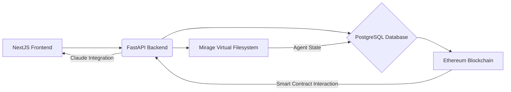

```markdown
# Software Architecture Document: Plan Week 1 - Mirage Integration & Initial Setup

**Version:** 1.0
**Date:** October 26, 2023

## 1. System Overview

This system will simulate DAO governance scenarios using Claude for scenario generation and persist agent state via the Mirage Virtual Filesystem. The system will expose a basic API for agent interaction and data retrieval. The core purpose is to provide a demonstrable, data-driven simulation engine, mitigating risks associated with overly optimistic projections.

**High-Level Diagram:**



## 2. Component Architecture

*   **NextJS Frontend:** Responsible for the user interface, allowing users to initiate simulations, view results, and potentially interact with the system.
*   **FastAPI Backend:** The core application logic, handling API requests, interacting with the database, Claude, and the Mirage Virtual Filesystem.
*   **PostgreSQL Database:** Stores persistent data, including DAO strategy definitions, simulation results, and potentially agent state (depending on design choices).
*   **Mirage Virtual Filesystem:**  Used for persistent storage of DAO parameters and simulation results, providing a decentralized and verifiable storage layer.
*   **Ethereum Blockchain:**  Used for smart contract interaction, potentially for managing DAO parameters or executing simulation outcomes (future expansion).
*   **Claude:**  Utilized for generating diverse simulation scenarios based on input parameters.

## 3. Data Flow

1.  **User Interaction:** The user interacts with the NextJS frontend.
2.  **API Request:** The frontend sends a request to the FastAPI backend via the API endpoints.
3.  **Simulation Logic:** The backend receives the request, potentially calls Claude to generate a new simulation scenario.
4.  **Data Retrieval/Storage:** The backend retrieves relevant data from the PostgreSQL database or stores new data.
5.  **Mirage Integration:** The backend interacts with the Mirage Virtual Filesystem to persist agent state and simulation results.
6.  **Blockchain Interaction (Future):**  The backend interacts with smart contracts on the Ethereum blockchain for specific actions (e.g., executing simulation outcomes).
7.  **Response:** The backend sends a response back to the frontend.

## 4. API Design

*   **GET /api/strategies:**
    *   **Description:** Retrieves a list of all DAO strategies.
    *   **Request:** None
    *   **Response:** JSON array of strategy objects.
*   **GET /api/strategies/:strategyId:**
    *   **Description:** Retrieves a specific DAO strategy by ID.
    *   **Request:**  `strategyId` (path parameter)
    *   **Response:** JSON object representing the strategy.
*   **POST /api/simulations:**
    *   **Description:** Initiates a new simulation run for a given DAO strategy.
    *   **Request:** JSON payload containing strategy ID, parameters, and other simulation settings.
    *   **Response:** JSON object containing simulation ID and status.
*   **GET /api/simulation-results:**
    *   **Description:** Retrieves a list of all simulation results.
    *   **Request:** None
    *   **Response:** JSON array of simulation result objects.

## 5. Database Schema (Conceptual)

| Table Name       | Columns                               | Data Type        | Description                               |
|------------------|---------------------------------------|------------------|-------------------------------------------|
| `dao_strategies` | `id` (PK), `name`, `parameters`        | UUID, VARCHAR     | Definition of a DAO strategy              |
| `simulation_results`| `id` (PK), `strategy_id` (FK), `result_data`, `timestamp` | UUID, UUID, JSON, TIMESTAMP | Result of a simulation run                |

## 6. Security Considerations

*   **Input Validation:** Rigorous input validation on all API endpoints to prevent injection attacks and data corruption.
*   **Authentication/Authorization:** Implement authentication and authorization mechanisms to control access to the API and data.  Consider JWT or similar.
*   **Mirage Security:**  Secure the Mirage Virtual Filesystem configuration to prevent unauthorized access and manipulation of data.  Leverage Mirage's built-in security features.
*   **Blockchain Security:**  Implement appropriate security measures for interacting with smart contracts on the Ethereum blockchain (e.g., secure key management).
*   **Claude Security:**  Carefully manage Claude API keys and usage to prevent abuse or unauthorized access.

## 7. Scalability Notes

*   **FastAPI:** FastAPI is designed for asynchronous operations and can handle a large number of concurrent requests.
*   **PostgreSQL:**  Consider using a scalable PostgreSQL deployment (e.g., cloud-managed service) with appropriate indexing and query optimization.
*   **Mirage:**  The Mirage Virtual Filesystem is designed for decentralized storage and can scale horizontally.
*   **Caching:** Implement caching mechanisms to reduce database load and improve response times.

## 8. Deployment Architecture

*   **Frontend:** Deploy the NextJS frontend to a static hosting platform (e.g., Netlify, Vercel).
*   **Backend:** Deploy the FastAPI backend to a cloud platform (e.g., AWS, Google Cloud, Azure) using a containerization technology like Docker and Kubernetes.
*   **Database:** Deploy the PostgreSQL database to a cloud-managed service (e.g., AWS RDS, Google Cloud SQL, Azure Database).
*   **Mirage:** Deploy the Mirage Virtual Filesystem component within the containerized backend application.
*   **Ethereum:** Utilize a local Ethereum development network (e.g., Ganache) for initial development and testing, transitioning to a public testnet or mainnet for production.
```